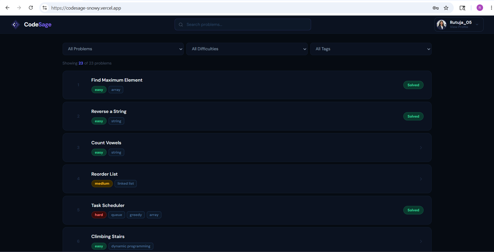
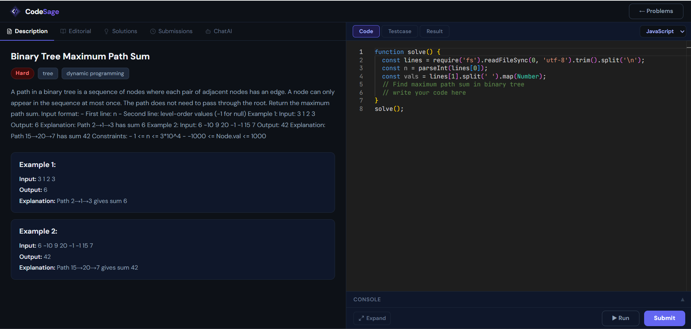
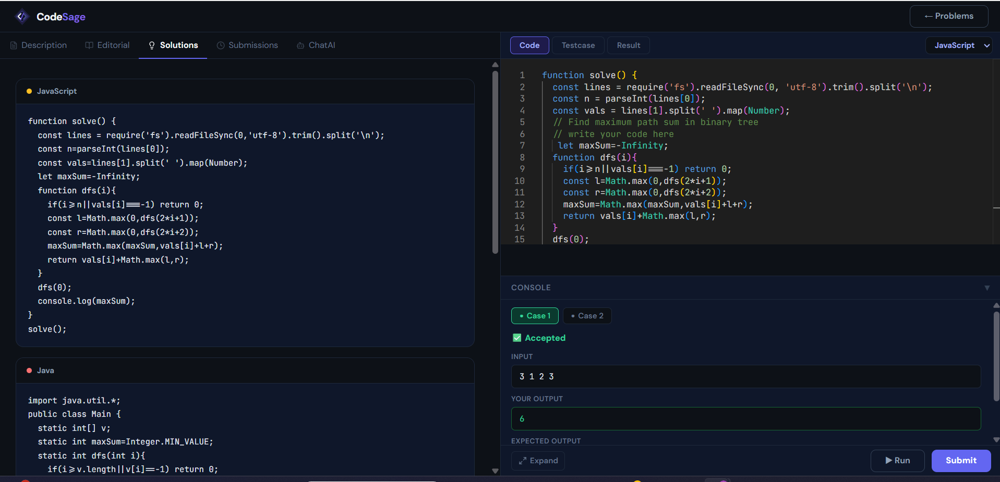
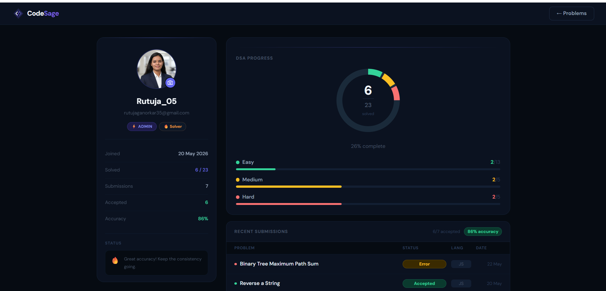
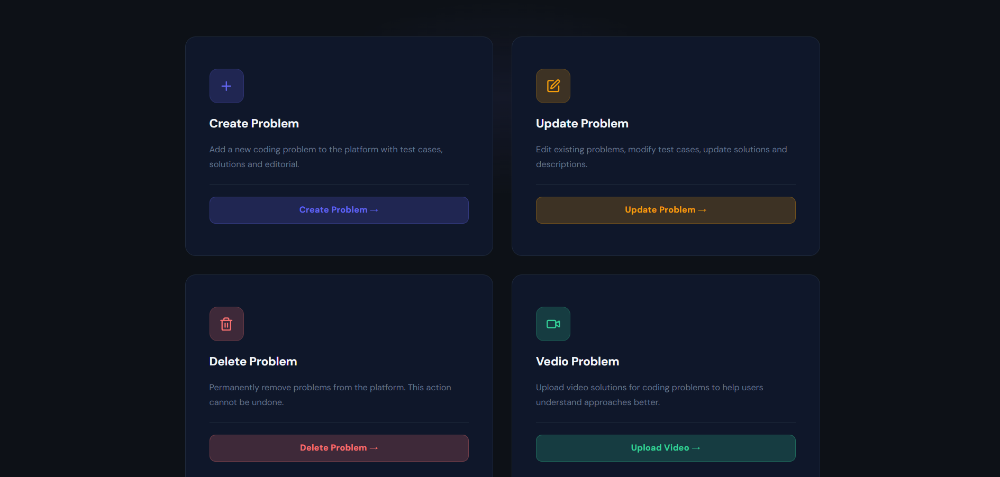
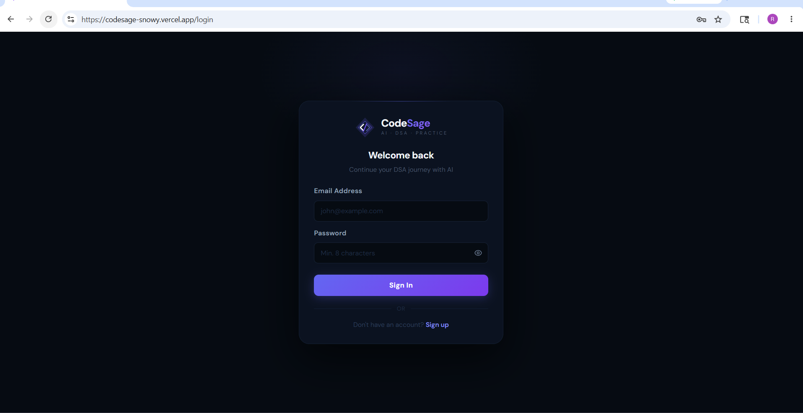

<div align="center">

<br/>

# ◈ CodeSage

### AI · DSA · PRACTICE

**Practice DSA problems with your personal AI mentor**

<br/>

[](https://codesage-snowy.vercel.app)
[](https://github.com/rutuja-ganorkar21/codesage-frontend)
[](https://github.com/rutuja-ganorkar21/codesage-backend)

</div>

---

## 📌 What is CodeSage?

**CodeSage** is a full-stack LeetCode-style DSA practice platform with a built-in **AI mentor powered by Google Gemini**. Users can solve coding problems in a real VS Code-like editor, run and submit code in 3 languages, get AI-driven hints and explanations, watch video solutions, and track their progress — all in one place.

> Think of it as LeetCode, but with a personal AI tutor guiding you through every problem.

---

## ✨ Features

### 🧠 AI-Powered Problem Solving (Google Gemini)
- Get **context-aware hints** without spoiling the full solution
- Ask for **code suggestions, explanations, and debugging help**
- AI is aware of the **exact problem you are solving**
- Accessible via the **ChatAI tab** on every problem page

### 💻 Code Editor & Execution (Judge0 + Monaco)
- **Monaco Editor** — same engine as VS Code
- Supports **3 languages**: JavaScript, Java, C++
- **Run** code against sample test cases with instant feedback
- **Submit** solutions — see Accepted / Wrong Answer / Error
- Real-time console: Input / Your Output / Expected Output

### 📋 Problem Page — 5 Tabs
| Tab | Description |
|-----|-------------|
| Description | Problem statement, examples, constraints |
| Editorial | Step-by-step approach |
| Solutions | Reference solutions in JS, Java, C++ |
| Submissions | Your personal submission history for that problem |
| ChatAI | Gemini-powered AI assistant scoped to this problem |

### 📊 User Profile & Progress Tracking
- Circular **DSA Progress ring** with total solved count
- Separate progress bars for **Easy / Medium / Hard**
- **Recent Submissions** table — problem name, status, language, date
- **Accuracy %** calculated from accepted vs total submissions
- Dynamic **status message** based on your performance

### 🎬 Video Solutions
- Admin-uploaded video explanations per problem
- Videos stored on **Cloudinary**
- Streamed directly on the problem page

### 🔐 Admin Dashboard (Admin-only)
| Action | Description |
|--------|-------------|
| Create Problem | Add problem with test cases, editorial, solutions |
| Update Problem | Edit any problem's content |
| Delete Problem | Permanently remove a problem |
| Upload Video | Attach a video solution to any problem |

### 👤 Authentication
- JWT-based secure auth with **httpOnly cookies**
- Password hashing via **bcrypt**
- Role-based access: **User** and **Admin**
- Profile picture upload/update/delete via **Cloudinary**

---

## 🛠️ Tech Stack

### Frontend
| Technology | Purpose |
|---|---|
| React 19 + Vite | UI Framework & Build Tool |
| Tailwind CSS v4 + DaisyUI | Styling & UI Components |
| Monaco Editor (`@monaco-editor/react`) | VS Code-like Code Editor |
| Redux Toolkit + React Redux | Global State Management |
| React Router v7 | Client-side Routing |
| React Hook Form + Zod | Form Handling & Validation |
| Axios | HTTP Client |
| React Responsive | Responsive layout handling |

### Backend
| Technology | Purpose |
|---|---|
| Node.js + Express v5 | Server & REST API |
| MongoDB + Mongoose | Database & ODM |
| Redis | Caching & session support |
| Google Gemini (`@google/genai`) | AI Mentor — hints, explanations, suggestions |
| Judge0 | Code execution engine (JS, Java, C++) |
| Cloudinary | Video & profile picture storage |
| JWT + bcrypt | Authentication & password security |
| cookie-parser | Cookie-based session handling |
| validator | Input validation |

---

## 📁 Project Structure

### Frontend
```
codesage-frontend/
└── src/
    ├── assets/
    ├── components/
    │   ├── AdminDelete.jsx       # Admin: delete problem UI
    │   ├── AdminPanel.jsx        # Admin dashboard home
    │   ├── AdminUpdate.jsx       # Admin: update problem
    │   ├── AdminUpdateFor.jsx    # Admin: update form
    │   ├── AdminUpload.jsx       # Admin: upload video
    │   ├── AdminVedio.jsx        # Admin: video management
    │   ├── ChatAi.jsx            # Gemini AI chat component
    │   ├── Editorial.jsx         # Problem editorial tab
    │   ├── ProfilePicture.jsx    # Profile pic upload/update
    │   ├── ProgressPanel.jsx     # DSA progress ring & bars
    │   └── UserProfile.jsx       # User profile page
    ├── pages/
    │   ├── Admin.jsx             # Admin route page
    │   ├── Homepage.jsx          # Problems list page
    │   ├── Login.jsx             # Login page
    │   ├── ProblemPage.jsx       # Problem solving page
    │   └── Signup.jsx            # Signup page
    ├── store/
    │   └── store.js              # Redux store
    ├── utils/
    │   └── axiosClient.js        # Axios instance with base URL
    ├── authSlice.js              # Redux auth slice
    └── App.jsx
```

### Backend
```
codesage-backend/
└── src/
    ├── config/
    │   ├── db.js                 # MongoDB connection
    │   └── redis.js              # Redis connection
    ├── controllers/
    │   ├── solveDoubt.js         # Gemini AI — chat/hint logic
    │   ├── userAuthent.js        # Auth — register, login, logout
    │   ├── userProblem.js        # Problem CRUD + fetch logic
    │   ├── userSubmission.js     # Code run/submit + profile pic
    │   └── vedioSection.js       # Video upload/delete logic
    ├── middleware/
    │   ├── adminMiddlware.js     # Admin-only route guard
    │   └── userMiddleware.js     # Auth route guard
    ├── models/
    │   ├── problem.js            # Problem schema
    │   ├── solutionVedio.js      # Video metadata schema
    │   ├── submission.js         # Submission schema
    │   └── user.js               # User schema
    ├── routes/
    │   ├── aiChatting.js         # AI chat routes
    │   ├── ProblemCreater.js     # Problem CRUD routes
    │   ├── submit.js             # Code run/submit routes
    │   ├── userAuth.js           # Auth routes
    │   └── vedioCreator.js       # Video routes
    ├── utils/
    │   ├── ProblemUtility.js     # Judge0 integration utility
    │   └── validator.js          # Input validation helpers
    └── index.js                  # Entry point
```

---

## 🔗 API Reference

### Auth Routes — `/api/auth`
| Method | Endpoint | Auth | Description |
|--------|----------|------|-------------|
| POST | `/register` | ❌ | Register new user |
| POST | `/login` | ❌ | Login and get JWT cookie |
| POST | `/logout` | User | Logout user |
| GET | `/check` | User | Check session & get user info |
| POST | `/admin/register` | Admin | Register a new admin |
| DELETE | `/deleteProfile` | User | Delete user profile |
| GET | `/profile-pic-signature` | User | Get Cloudinary upload signature |
| POST | `/save-profile-picture` | User | Save profile picture URL |
| DELETE | `/delete-profile-picture` | User | Delete profile picture |

### Problem Routes — `/api/problems`
| Method | Endpoint | Auth | Description |
|--------|----------|------|-------------|
| POST | `/create` | Admin | Create a new problem |
| PUT | `/update/:id` | Admin | Update a problem |
| DELETE | `/delete/:id` | Admin | Delete a problem |
| GET | `/getAllProblem` | User | Get all problems list |
| GET | `/problemById/:id` | User | Get single problem details |
| GET | `/problemSolvedByuser` | User | Get problems solved by user |
| GET | `/submittedProblem/:pid` | User | Get submissions for a problem |

### Code Execution Routes — `/api/submit`
| Method | Endpoint | Auth | Description |
|--------|----------|------|-------------|
| POST | `/runcode/:id` | User | Run code against test cases |
| POST | `/submit/:id` | User | Submit solution for a problem |
| GET | `/getUserSubmissions` | User | Get all user submissions |

### AI Routes — `/api/ai`
| Method | Endpoint | Auth | Description |
|--------|----------|------|-------------|
| POST | `/chat` | User | Send message to Gemini AI mentor |

### Video Routes — `/api/video`
| Method | Endpoint | Auth | Description |
|--------|----------|------|-------------|
| GET | `/create/:problemId` | Admin | Get Cloudinary upload signature |
| POST | `/save` | Admin | Save video metadata |
| DELETE | `/delete/:problemId` | Admin | Delete a video |

---

## 📸 Screenshots

### 🏠 Problems List


### 💻 Problem Page — Description & Editor


### ⚙️ Problem Page — Solutions & Console


### 👤 User Profile & DSA Progress


### 🔧 Admin Dashboard


### 🔐 Login & Signup


---

## 🚀 Getting Started

### Prerequisites
- Node.js v18+
- MongoDB (local or Atlas)
- Redis
- Judge0 (self-hosted or via RapidAPI)
- Google Gemini API Key
- Cloudinary Account

### 1. Clone the Repositories

```bash
# Frontend
git clone https://github.com/rutuja-ganorkar21/codesage-frontend.git

# Backend
git clone https://github.com/rutuja-ganorkar21/codesage-backend.git
```

### 2. Backend Setup

```bash
cd codesage-backend
npm install
```

Create `.env` in backend root:

```env
PORT=3000
MONGODB_URI=your_mongodb_connection_string
JWT_SECRET=your_jwt_secret_key
REDIS_URL=your_redis_url

GEMINI_API_KEY=your_google_gemini_api_key

JUDGE0_API_URL=your_judge0_api_url
JUDGE0_API_KEY=your_judge0_api_key

CLOUDINARY_CLOUD_NAME=your_cloudinary_cloud_name
CLOUDINARY_API_KEY=your_cloudinary_api_key
CLOUDINARY_API_SECRET=your_cloudinary_api_secret
```

```bash
node src/index.js
```

### 3. Frontend Setup

```bash
cd codesage-frontend
npm install
```

Create `.env` in frontend root:

```env
VITE_API_BASE_URL=http://localhost:3000
```

```bash
npm run dev
```

### 4. Open in Browser

```
http://localhost:5173
```

---

## 🌐 Deployment

| Layer | Platform |
|-------|----------|
| Frontend | [Vercel](https://vercel.com) |
| Backend | Render / Railway |
| Database | MongoDB Atlas |
| Cache | Redis Cloud |
| Media & Videos | Cloudinary |
| Code Execution | Judge0 |

🔗 **Live:** [https://codesage-snowy.vercel.app](https://codesage-snowy.vercel.app)

---

## 🤝 Contributing

1. Fork the repository
2. Create your feature branch (`git checkout -b feature/YourFeature`)
3. Commit your changes (`git commit -m 'Add YourFeature'`)
4. Push to the branch (`git push origin feature/YourFeature`)
5. Open a Pull Request

---

## 👩‍💻 Author

**Rutuja Ganorkar**

[](https://github.com/rutuja-ganorkar21)

---

## 📄 License

This project is open source and available under the [MIT License](LICENSE).

---

<div align="center">

Made with ❤️ by Rutuja Ganorkar

⭐ **If you found this helpful, please star the repo!**

</div>
